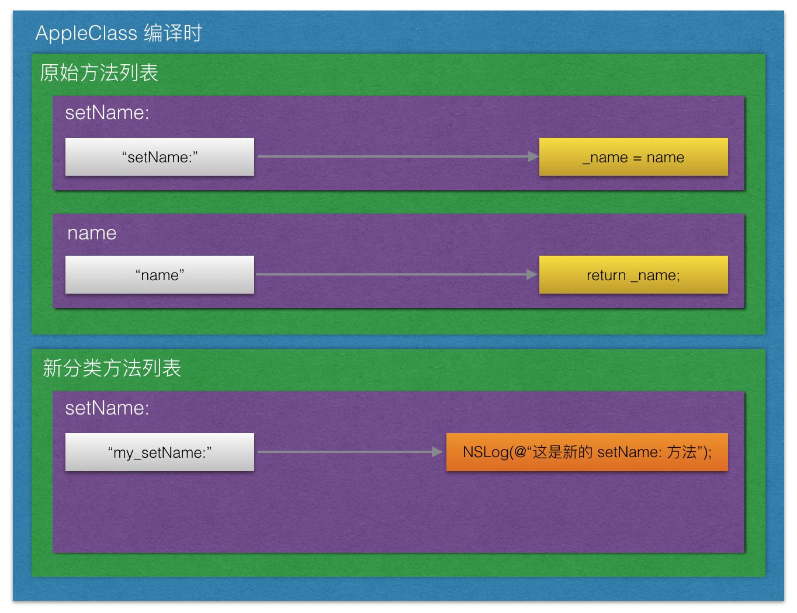
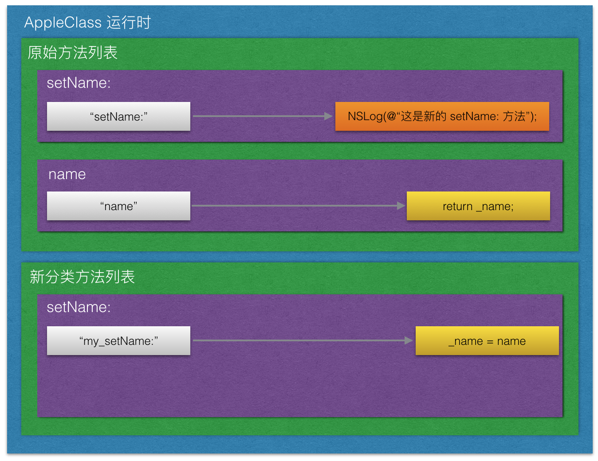
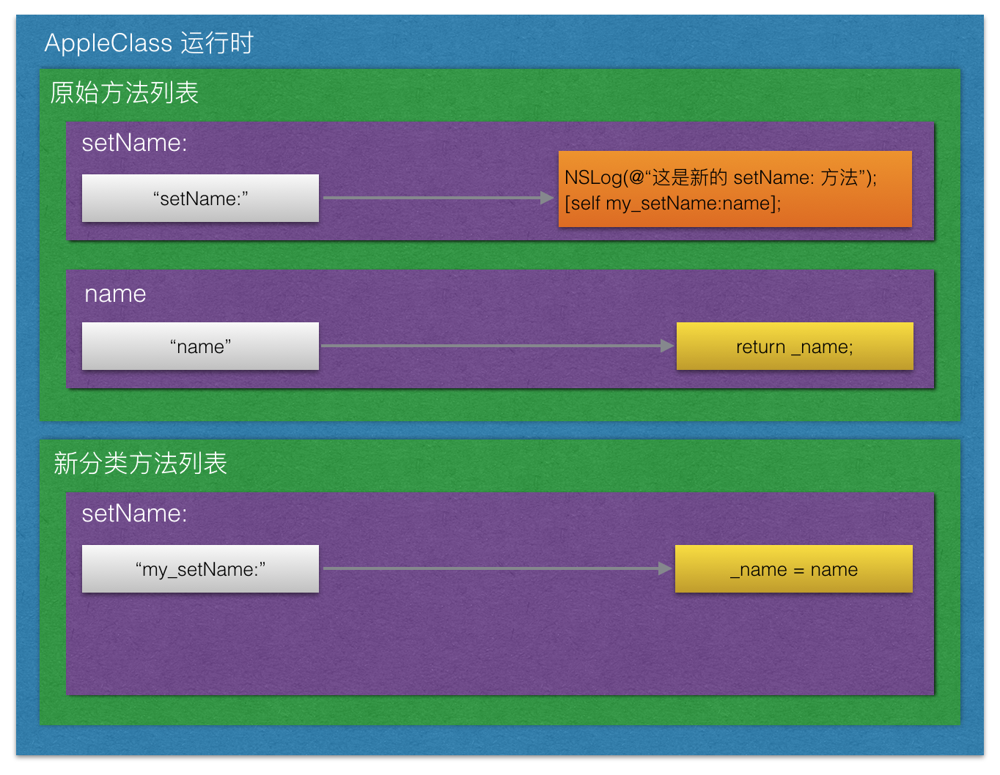

# Runtime 的实践（六）——重写CocoaTouch框架

[上一篇: Runtime的实践（五）](https://github.com/Magic-Unique/Runtime/blob/master/E.5.Runtime的实践（五）.md)

CocoaTouch 框架是苹果公司仿造Cocoa框架专门为iOS设计的一套SDK.

这套SDK没有对外公布源代码, 开发者无法获取到这些SDK的内部实现原理, 也无法去直接修改这套SDK.

在仅有的面向对象基础上, 开发者要想修改这些系统提供的类, 唯一的方式就是**继承**. 

如果开发前期将一些常用的类都做了**继承**处理(也可以称之为*二次封装*), 则在开发后期如果出现大范围修改代码就会节省很多事情.

然而后期将会出现的事情是无法预测的. 如果前期没有做过基本的封装处理, 则后期的大范围修改就会是一件很蛋疼的事情.

比如你要将整个App的`UINavigationBar`做一个统一处理(这里并非指主题样式统一化, 而是一些新逻辑统一化), 那你就要将整个App用到的`UINavigationController`都做统一处理. 这是一件很费劲的事情.

**如果能直接修改系统自带的类就不需要统一继承了.**

**修改系统类**要做的最基本的事情就是**修改这些类的方法**.

这个篇幅中主要围绕修改苹果给的类的方法来展开的.

## OC层修改闭源CocoaTouch

你可以尝试使用分类来做, 比如:

> 我们首先使用一个简易的类来**模拟苹果提供的类**, 假装这个类不是我们写的
> 
> ```objc
> @interface AppleClass : NSObject
> 
> @property (nonatomic, copy) NSString *name;
> 
> @end
> ```
> 
> 然后我们在外面调用这个类的`name`的`get`方法和`set`方法
> 
> ```objc
> AppleClass *appleClass = [AppleClass new];
> appleClass.name = @"I am a class created by Apple Inc.";
> NSLog(@"%@", appleClass.name);
> ```
> 
> 控制台成功输出内容为:
> 
> ```
> I am a class created by Apple Inc.
> ```
> 
> 现在我们尝试着修改这个`AppleClass`的`setName:`方法. 由于这个类"不是我们写的", 所以我们不能在`.m`文件里面直接修改这个类的方法.
> 我们可以尝试使用分类来实现:
> 
> ```objc
> @implementation AppleClass (Modify)
> 
> - (void)setName:(NSString *)name {
>     NSLog(@"这是新的 setName: 方法");
> }
> 
> @end
> ```
> 
> 再次按照上面的方式调用一次, 新的控制台输出为:
> 
> ```
> 这是新的 setName: 方法
> (null)
> ```
> 
> 所以我们可以得出一个结论:
> 
> **分类可以直接修改类中的方法**
> 
> 但是问题来了, 我们修改了方法, 但是原有的方法的功能被我们直接覆盖了(从输出为null就可以发现赋值失败). 那我们如何保证原有类的方法依旧还在并且还是可以调用呢?
> 
> 在继承中, 重写一个类的方法的时候我们可以使用`super`关键字来调用父类的原方法, 在这里可以尝试一下.
> 
> ```objc
> - (void)setName:(NSString *)name {
>     NSLog(@"这是新的 setName: 方法");
>     [super setName:name];//Xcode在这里报错了
> }
> ```
> 
> 这里的`super`是`NSObject`, 它没有`setName:`方法.
> 
> 显而易见, 实现这个方法是`AppleClass`而不是`NSObject`, 所以在`AppleClass`中调用它自己的方法应该使用`self`而不是`super`
> 
> 于是我们可以这么写:
> 
> ```objc
> - (void)setName:(NSString *)name {
>     NSLog(@"这是新的 setName: 方法");
>     [self setName:name];
> }
> ```
> 
> 编译成功, 但是运行起来是一个死递归, 然后炸了.
> 
> **所以我们无法保留原有类的方法实现, 因为被我们直接覆盖了**
> 
> 最终结论:
> 
> 1. 分类可以直接修改原有类的方法, 其修改方式是直接覆盖同名方法的实现.
> 2. 分类覆盖方法后无法保留原有方法的实现.
> 3. 如果想让方法原有的功能依旧存在, 就不能使用分类来修改类.
> 

如果我既要保留原有方法的功能, 又想在原有方法里添加我自己的方法怎么办?

在这种情形下, 我们可以尝试使用上一篇的**方法交换**来达到这个目的.

## Runtime层修改闭源CocoaTouch

### 归纳情况
在继承中, 如果我们重写父类的方法, 一般会使用`super`来调用一次父类的方法. 最常见的是重写`UIViewController`:

```objc 
File: MyViewController.h

@interface MyViewController : UIViewController
@end
```

```objc
File: MyViewController.m

@implementation MyViewController

- (void)viewDidLoad {
    [super viewDidLoad];
	NSLog(@"viewDidLoad 调用完毕");
}
@end
```

一般这种情况我们会吧调用`super`的方法写在整个方法的开头, 就如上面一样, 但是我们也可以向下面这样, 先调用自己的方法, 在调用父类方法. 如:

```objc
File: MyViewController.m

@implementation MyViewController

- (void)viewDidLoad {
	NSLog(@"viewDidLoad 即将调用");
	[super viewDidLoad];
}
@end
```

甚至我们可以先调用自己的方法, 再调用父类方法, 然后调用自己的方法. 如:

```objc
File: MyViewController.m

@implementation MyViewController

- (void)viewDidLoad {
	NSLog(@"viewDidLoad 即将调用");
    [super viewDidLoad];
	NSLog(@"viewDidLoad 调用完毕");
}
@end
```
当然, 如果你开心的话, 连`super`都可以不调用, 但是这个是很危险的事情,如:

```objc
File: MyViewController.m

@implementation MyViewController

- (void)viewDidLoad {
	NSLog(@"开心就好");
}
@end
```


所以我们最终结论就是:

> 继承可以让我们对父类方法做修改, 这些修改包括
> 
> 1. 是否调用父类方法;
> 2. 在调用父类方法前加入代码;
> 3. 在调用父类方法后加入代码;

### 分析

由于分类会直接导致原方法实现被覆盖, 则上述三个修改目的都无法使用分类达到.

分类既然是覆盖这个方法的实现, 所以我们无法得到原有的实现. 那我们可以分析, 如果我们在这个方法被覆盖之前, 使用一个缓存将原有的方法复制一份出来, 再让他进行覆盖, 这样就可以保存原有的实现了. 然后再新的方法中, 调用一次拷贝版的方法实现, 就能达到上述的目的. 于是步骤总结如下

1. 拷贝一份原有的方法
2. 覆盖原有的方法
3. 在新的方法中调用拷贝版本的方法

现在要做的就是, 在覆盖之前拷贝一份代码. 由于分类会直接参与编译, 所以当程序运行前, 原有的方法就已经被覆盖了. 所以我们无法在这种情况下找到覆盖时机. 那我们可以尝试使用runtime来覆盖, 这样我们就可以控制覆盖时机了.

runtime覆盖方式有很多种, 在上一个篇幅中, 我们就有一个覆盖方式——方法交换. 这个方式最终结果是会导致两个方法的实现交换, 同样向一个对象发送同一个消息, 交换前调用的方法和交换后调用的方法不一样. 而且方法交换并不会导致其中一个方法的实现被覆盖.

于是我们可以新建一个方法, 这个方法的参数列表和原方法一样, 返回值也是一样, 然后我们在里面写我们自己想要加入的代码. 方法交换后即可保留两个方法的实现.

### 利用Runtime的方法交换实现类修改

#### 1. 添加自己的代码

> 回到原来的分类的实现文件中, 对方法进行方法名修改, 和实现的修改, 修改后如下:
> 
> ```objc
> @implementation AppleClass (Modify)
> 
> - (void)my_setName:(NSString *)name {
> 		NSLog(@"这是新的 setName: 方法");
> 		[self setName:name];
> }
> 
> @end
> ```
> 
> 这样就可以实现调用`my_setName:`方法的时候达到既**添加代码**又**保存原功能**的目的了. 但是外部并不知道需要调用这个方法, 他们只会乖乖地调用`setName:`方法, 或者如果方法是系统调用的也无法自动调用`my_setName:`方法, 所以这个案例不可行.
> 
> 将新的方法作如下修改:
> 
> ```objc
> @implementation AppleClass (Modify)
> 
> - (void)my_setName:(NSString *)name {
> 		NSLog(@"这是新的 setName: 方法");
> }
> 
> @end
> ```
> 于是变成下面这个结构:
> 
> 
> 
> **这里要注意**
> 
> **1. 箭头左边是接口, 右边是实现, 调用左边的方法, 会做出右边的响应**
> 
> **2. 黄色部分我们不能修改, 橙色部分我们可以修改**
> 
> **3. 这是编译时候的样子, 也就是我们写的代码的样子**
> 
> 现在我们做的第一步就是, 让调用原方法的时候能够调到我们自己的实现, 也就是利用方法交换, 把`setName:`方法的实现和`my_setName:`方法的实现做出交换, 并且这个交换是只有在执行方法交换的时候才会有效果, 也就是运行时的样子和编译时候的样子.
> 
> 执行:
> 
> ```objc
> Method setName = class_getInstanceMethod([self class], @selector(setName:));
> Method mySetName = class_getInstanceMethod([self class], @selector(my_setName:));
> method_exchangeImplementations(setName, mySetName);
> ```
> 
> 运行后结构体变为如下图:
> 
> 
> 
> **这里还需要注意**
> 
> **1. 黄色不可修改, 橙色可以修改**
> 
> **2. 这是运行后的样子, 和我们写的代码不一样**
> 
> 现在成功调用`setName:`方法后执行我们的代码, 那么问题来了, 如何保留原有的功能呢? 也就是在**如何做到橙色的地方必须要有原有的代码**?
> 
> 我们可以观察一下, 现在原有的实现在`my_setName:`的接口下, 也就是说此时如果调用`my_setName:`方法, 就是原有方法的实现.
> 
> 那我们就可以在**橙色的那块代码中调用一次`my_setName`**.
> 
> 然后变成如下图所示:
> 
> 
> 
> 这样我们就实现了:
> 
> **调用旧的方法会先执行新的代码, 后执行旧的代码, 在不改变原有的代码基础上加入了自己的代码**.
> 
> 那么, 代码具体如何实现呢? 我们可以将两块实现换回来, 看看没有交换的情况下, 代码是长什么样子的:
> 
> 
> 
> 这样, 我们就知道我们应该如何去修改我们的分类了:
>
> ```objc
> @implementation AppleClass (Modify)
> 
> - (void)my_setName:(NSString *)name {
> 		NSLog(@"这是新的 setName: 方法");
> 		[self my_setName:name];
> }
> 
> @end
> ```
> 
> **这是一个很奇怪的现象**
> 
> **1. 在编译时, 这是一个死递归**
> 
> **2. 在运行时, 却不会出现死递归**
> 
> 通过以上内容, 你应该可以深刻体会到**OC为什么是一个有运行时特色的语言了**
> 
> 还差一个遗漏的地方, 就是何时执行那个`method_exchangeImplementations()`函数对方法实现进行交换?
> 
> 最好的时间就是最早的时间, 也就是所有代码执行前. 在代码执行前都会把类加载到内存中. 我们可以在任意一个类的`load`方法里写这个函数.
> 
> 方案已经经过分析可行性, 具体总结操作如下:
> 
> 1. 创建一个这个类的分类
> 2. 新建一个新的参数列表相同的方法
> 3. 在方法里写自己的代码, 并在代码最后调用一次自己
> 4. 在这个类的`load`方法里将两个方法交换
> 
> 最终, 这个分类文件是这样的:
> 
> ```objc
> #import <objc/runtime.h>
> 
> @implementation AppleClass (Modify)
> 
> + (void)load {
> 	Method setName = class_getInstanceMethod([self class], @selector(setName:));
> 	Method mySetName = class_getInstanceMethod([self class], @selector(my_setName:));
> 	method_exchangeImplementations(setName, mySetName);
> }
> 
> - (void)my_setName:(NSString *)name {
> 	NSLog(@"这是新的 setName: 方法");
> 	[self my_setName:name];
> }
> 
> @end
> ```
> 
> 然后控制台输出:
> 
> ```
> 这是新的 setName: 方法
> I am a class created by Apple Inc.
> ```

以上就是方法交换修改CocoaTouch的方法, 这个方法千万**慎用**.

**慎用**

**慎用**

**慎用**

> 以上代码是实现在调用方法前添加自己的代码, 如果你想要在调用方法后添加自己的代码的话, 可以将递归代码写在自己的代码前面.
> 

[上一篇: Runtime的实践（五）](https://github.com/Magic-Unique/Runtime/blob/master/E.5.Runtime的实践（五）.md)